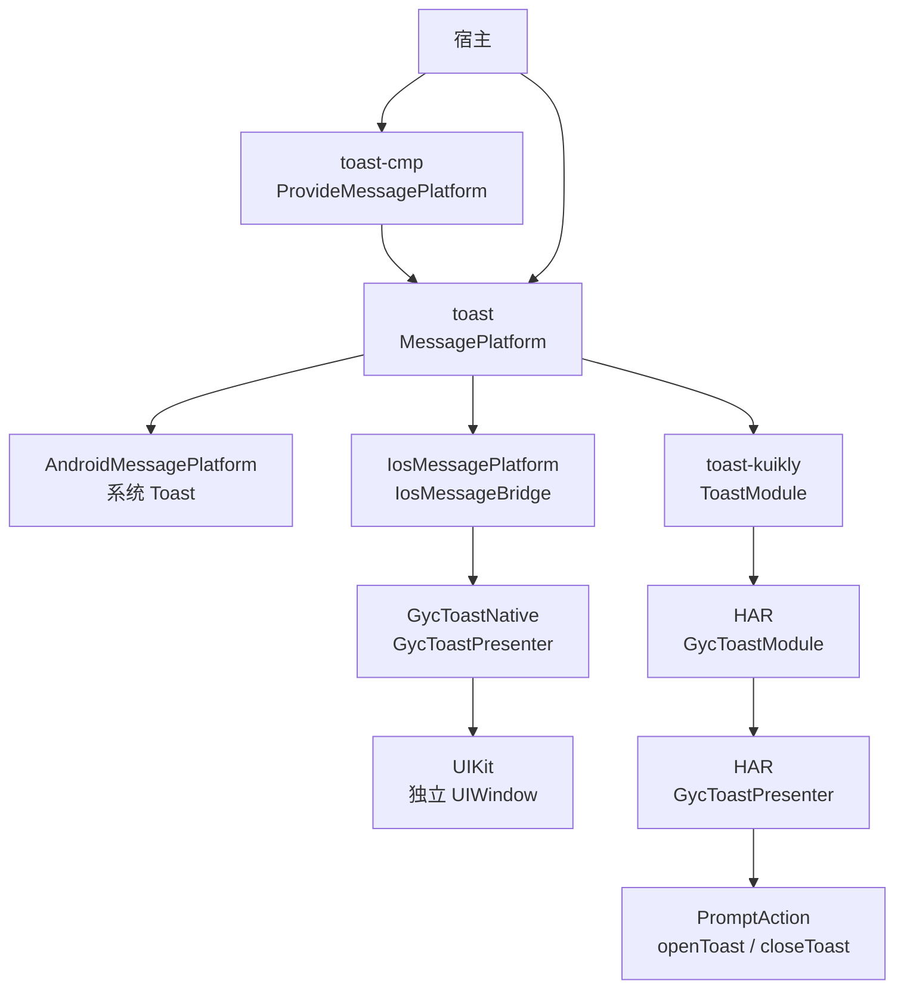
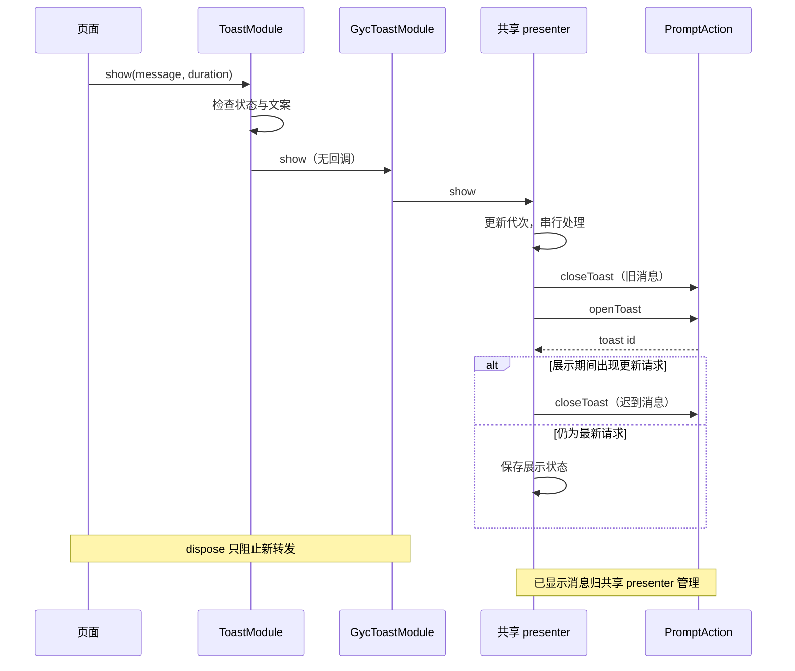
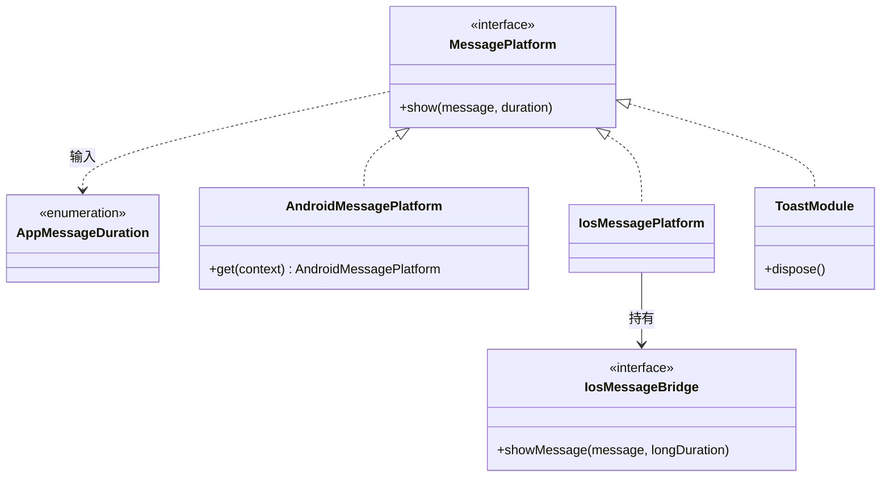

# GY CrossKit Toast

2026-10-08 功能索引：toast core提供消息/Overlay状态与规格，toast-cmp提供Android/iOS Host，toast-kuikly提供Android/iOS/OHOS Host；legacy原生提示与Overlay的视觉/时长合同不同。 详见[功能与平台差异](docs/功能与平台差异.md)，含固定基线、五入口矩阵、真实回归与未验收范围。本次仅正式0.1.5基线的文档候选。

最终核对（2026-10-08）：本轮在正式WT重跑core5项；MessageHost参数仅源码核对，真实字体/多行/读屏未验。 逐项时点与边界见[验证范围](docs/功能与平台差异.md#sdk系统与真实验证范围)。

当前源码版本为 0.1.5：Kuikly `MessageHost` 将背景和 padding 交给独立 Box，修复 Kuikly 2.28 文案靠上；共同状态、规格、定时替换和销毁合同不变。Maven/Swift 使用 0.1.5，鸿蒙原生 HAR 继续配套 0.1.3。0.1.5 的正式发布与远程消费结果以对应 Release 为准；下方 0.1.3 验证记录属于历史版本。

CMP Android/iOS 与 Kuikly Compose Android/iOS/OHOS 的共同 Overlay 接线见[跨端行为说明](docs/跨端行为候选.md)。组件编译和远程解析不能代替宿主正常、暗色、长文案及真机居中验收。

Android、iOS 和 HarmonyOS 的短消息展示。新消息替换旧消息；文案和本地化由宿主提供。KMP入口为 `MessagePlatform`；CMP与KuiklyCompose均提供CompositionLocal/MessageHost，legacy OHOS额外提供ToastModule。

历史0.1.3轮次的Maven/Swift/Git Pod/HAR候选为0.1.3，[prerelease 已发布](https://github.com/gycrosskit/toast/releases/tag/0.1.3)，实际下载 SHA 与 JitPack 全 13 个 module 的文件引用校验通过。独立真实 JitPack OHOS Kuikly、Android/iOS CMP 编译及 Simulator 最终链接、Release HAR 独立编译通过；安装示例使用候选精确版本，设备展示尚未验收。

历史0.1.3轮次的OHPM next提交接受后曾仍在审核，精确Registry安装返回NOTFOUND，当时latest为0.1.2；本次文档更新未重新查询Registry，不据历史状态断言当前可安装。Release HAR下载不代表Registry安装。

## 平台与要求

| 平台 | 接入方式 | 系统要求 |
| --- | --- | --- |
| Android | Overlay用`toast-cmp`或`toast-kuikly`；legacy用`toast` | API 24+ |
| iOS | Overlay用`toast-cmp`或`toast-kuikly`；legacy用KMP bridge+`GycToastNative`或Swift/Pod | iOS 15+，Swift tools 5.9（原生包） |
| HarmonyOS | Overlay用`toast-kuikly`；legacy用Module+`toast-native` HAR或ArkTS | 当前 HAR 的 target/compatible SDK 均为 API 22；`openToast/closeToast` API 本身从 API 18 提供 |

KMP 使用 Kotlin `2.2.21-1.0.0`，CMP 使用 Compose `1.10.3`，Kuikly 使用 `2.28.0-2.0.21-ohos`。`toast-core/` 的 Gradle 模块名及公开 Maven artifact 为 `toast`。

## 架构与调用流程

`toast`定义MessagePlatform/OverlayState/Spec；`toast-cmp`与`toast-kuikly`各提供provider和MessageHost。下图保留legacy native路径：Android系统Toast、iOS桥与OHOS Module；共同Overlay在各自Host渲染，详见[功能与平台差异](docs/功能与平台差异.md)。文案与本地化由宿主提供。



HarmonyOS 展示通过共享 presenter 串行处理替换。Kuikly 的 `show` 是无结果回调的异步转发，调用返回不表示消息已经显示。



类图聚焦 KMP 契约及 bridge；CMP 的 `ProvideMessagePlatform`、`rememberMessages` 是函数，不是额外 Manager 类。



源码：[MessagePlatform 与时长](toast-core/src/commonMain/kotlin/io/github/gycrosskit/toast/MessagePlatform.kt)、[Android 实现](toast-core/src/androidMain/kotlin/io/github/gycrosskit/toast/AndroidMessagePlatform.kt)、[iOS 实现与 bridge](toast-core/src/iosMain/kotlin/io/github/gycrosskit/toast/IosMessagePlatform.kt)、[CMP 接线](toast-cmp/src/commonMain/kotlin/io/github/gycrosskit/toast/cmp/MessageComposition.kt)、[ToastModule](toast-kuikly/src/commonMain/kotlin/io/github/gycrosskit/toast/kuikly/ToastModule.kt)、[HAR Module](ohos/toast-native/src/main/ets/GycToastModule.ets)、[HAR Presenter](ohos/toast-native/src/main/ets/GycToastPresenter.ets)、[Swift Presenter](iosApp/Sources/GycToastNative/ToastPresenter.swift)。

## 安装

```kotlin
// settings.gradle.kts
dependencyResolutionManagement {
    repositories {
        maven("https://jitpack.io")
        maven("https://maven.eazytec-cloud.com/nexus/repository/maven-public/")
        google()
        mavenCentral()
    }
}
```

```kotlin
commonMain.dependencies {
    implementation("com.github.gycrosskit.toast:toast:0.1.5")
    // Compose Multiplatform 宿主额外添加：
    implementation("com.github.gycrosskit.toast:toast-cmp:0.1.5")
}
// HarmonyOS Kuikly 宿主额外添加：
ohosArm64Main.dependencies {
    implementation("com.github.gycrosskit.toast:toast-kuikly:0.1.5")
}
```

iOS 在 Xcode 的 Package Dependencies 添加 `https://github.com/gycrosskit/toast.git`，选择精确版本 `0.1.5`，产品 `GycToastNative`。CocoaPods 可按 Git tag 安装，见接入指南。

HarmonyOS 原生包独立安装，候选正式可查询后执行；发布接受与 Registry 可安装分别核验：

```sh
ohpm install @gycrosskit/toast-native@0.1.3
```

旧稳定 `0.1.2` 有 Git tag、JitPack Maven 和 OHPM 包，未补写旧 Release。新候选 `0.1.3` 的 Swift Package 和 Git Pod 已分别完成独立真实原生消费：公开 API 编译及动态消费者/framework 最终链接均通过，产物为 arm64/x86_64 iOS Simulator Mach-O。SPM 锁定发布提交，Git Pod framework 版本为 0.1.3；这两个渠道单独验收，不以 KMP framework 链接代替。

## 最小使用

```kotlin
import io.github.gycrosskit.toast.*
import io.github.gycrosskit.toast.cmp.*

// Android：在应用范围复用同一个实例。
val messages = AndroidMessagePlatform.get(applicationContext)
messages.show("操作完成")
// 在 Compose 应用根部：
ProvideMessagePlatform(messages) {
    // 页面内可调用 rememberMessages().show("操作完成")。
}
```

```swift
import GycToastNative
// 稳定的根 UIViewController 创建后绑定：
GycToastPresenter.shared.bind(rootController: rootController)
GycToastPresenter.shared.show(message: "操作完成")
```

## 生命周期与边界

Android 的不同 UI 引擎复用 `AndroidMessagePlatform.get(applicationContext)`，避免各自展示竞争。iOS 使用不可点击的独立 UIWindow，需要有效根控制器；KMP 宿主通过 `IosMessageBridge` 转发到原生 presenter。HarmonyOS 需要已创建主窗口的 UIAbilityContext 或注册 `GycToastModule`。

无需额外系统权限。空白文案不展示；仅支持短/长时长和新消息替换，不提供消息队列或交互式提示。原生窗口显示、替换和多窗口行为仍需宿主设备验收。

## 文档与帮助

- [接入指南](docs/接入指南.md)：平台初始化、权限声明和生命周期。
- [开发与验证](docs/开发与验证.md)：源码构建、检查命令与验收范围。
- [版本与发行说明](https://github.com/gycrosskit/toast/releases)、[问题反馈](https://github.com/gycrosskit/toast/issues)。

Apache-2.0，见 [LICENSE](LICENSE)。

## 0.1.3 候选：Kuikly 页面生命周期

每个 Pager 注册组件 `ToastModule` 和原生 `GycToastModule`，业务只映射消息文案/时长；`pageWillDestroy` 调用 `ToastModule.dispose()`，原生 `onDestroy` 后拒绝消息。
不再把showMessage协议复制到应用的系统动作Module；已显示Toast仍由唯一presenter管理，不由旧Page销毁新Page消息。

候选 Maven 的 core/CMP/Kuikly 坐标均显式选择 0.1.3，HAR 为 `@gycrosskit/toast-native@0.1.3`。Maven 已完成远程文件校验，OHPM 可安装性按上方独立状态记录。

本轮全生产文件覆盖与未测项见[完整源码审查](docs/完整源码审查.md)。

## 自动回归

[Component regression](.github/workflows/regression.yml) 在 PR 和 `main` 更新时运行现有 Python/Node 契约测试、Android 单元测试及编译，以及 macOS 上的 iOS/OHOS KLIB 编译；已有 iOS、JVM、Kuikly 独立测试也按该 workflow 执行。Release 发布或手动指定不可变版本后，校验 Release Maven 归档的 SHA-256、POM、metadata 与文件引用，并从 JitPack 独立编译 Android 消费者、链接 iOS 消费者、编译 OHOS Kuikly 消费者；toast 消费者同时编译 CMP 适配层。此流程不发布二进制。

OHOS KLIB 编译不代表 HAR 构建、ohpm 上架或真机验收。当前没有已确认可用的 DevEco/Hvigor runner，这些检查尚未自动化，不能作为 CI 通过范围。

PR 的发布回归固定验证已发布 `0.1.3` 基线，五个 job 都通过后才合并；Release 事件使用其精确标签。基线证明远程产物可消费，不代表 PR 新源码已发布。
